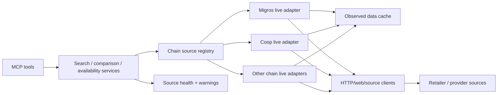

# Real Data Implementation Plan

Date: 2026-05-18
Status: draft for user review

Gemini review: GREEN LIGHT on 2026-05-18. Minor notes were to require exact
source endpoints/pages during source audit, formalize warning/error codes early,
and document policy decisions from the open questions before Phase 2.

## Goal

Remove static catalog and mock inventory from production runtime paths while
keeping the existing normalized MCP surface useful, explicit, and trustworthy.

The plan does **not** assume that Migros, Coop, Aldi, Denner, Lidl, Farmy,
Volg, and Otto's are equally solved. Each chain must earn its own `live` status
through a source audit, adapter implementation, parser tests, and live smoke
verification.

## Non-goals

- Do not add fake fallback data that hides integration failures.
- Do not scrape or call sources in ways that ignore robots.txt, terms, rate
  limits, or practical abuse concerns.
- Do not require account/cart integrations in this phase.
- Do not remove deterministic tests; remove only production dependency on
  static catalog data.

## Current Evidence

- The existing code has a good adapter boundary and normalized product/store
  contract, but V1 runtime data is static.
- Migros has an internal product API (`M-API`) that powers public surfaces and
  mobile apps, but available evidence describes it as internal and not publicly
  available.
- Open Food Facts provides open product data, nutrition/allergen metadata,
  product images, and an Open Prices component, but it is community-sourced and
  should be treated as enrichment/secondary price evidence rather than a full
  Swiss retailer source of truth.
- No chain should be marked production-live until its own source path is
  verified.

## Definitions

| Term | Meaning |
|---|---|
| Live source | Data fetched from an official API, documented partner API, public retailer web endpoint, retailer page, or approved third-party provider at runtime or through a freshness-controlled cache. |
| Fixture | A saved real response used in tests. Fixtures are allowed in tests because they validate parsers and contracts; they are not allowed as production data. |
| Cache | Persisted real observations with `observedAt`, `expiresAt`, source URL/provider, and freshness metadata. Cache may serve runtime data only when labeled as cached or stale. |
| Mock | Invented product/store/price/availability data. Mocks must not be used for runtime behavior. |

## Target Architecture



### New Components

| Component | Responsibility |
|---|---|
| `src/sources/` | Source clients for official APIs, web endpoints, HTML pages, or third-party providers. |
| `src/parsers/` | Pure parser functions that transform source payloads into typed intermediate records. |
| `src/adapters/live/` | Chain adapters that map parsed source records into `NormalizedProduct`, `NormalizedStore`, and `NormalizedPromotion`. |
| `src/cache/` | TTL cache for observed real data; starts file-based, replaceable later with SQLite/Redis. |
| `src/services/sourceHealthService.ts` | Tracks source freshness, failures, degradation, and last successful fetch per chain. |
| `fixtures/live-sources/` | Saved real source responses for parser and adapter contract tests only. |

## Domain Model Changes

Add provenance to normalized results:

```ts
interface SourceProvenance {
  provider: string;
  chain?: Chain;
  sourceType: 'official-api' | 'partner-api' | 'retailer-web' | 'third-party' | 'open-data';
  sourceUrl?: string;
  observedAt: string;
  freshness: 'live' | 'cached' | 'stale';
  cacheExpiresAt?: string;
  confidence: 'high' | 'medium' | 'low';
}
```

Add optional explanation metadata:

```ts
interface MatchExplanation {
  strength: number;
  matchedBy: Array<'name' | 'brand' | 'category' | 'tag' | 'taxonomy' | 'barcode' | 'provider-rank'>;
  matchedTerms: string[];
}
```

Extend MCP responses with:

- `sourceWarnings`: partial failures and degraded chains.
- `sources`: per-chain source status, freshness, and observed timestamps.
- `summary`: concise human-readable result text where helpful.

## Runtime Behavior

1. `search_products` fans out only to chains with enabled real adapters.
2. If a chain has no real source yet, return a source warning such as
   `REAL_SOURCE_NOT_IMPLEMENTED` instead of static products.
3. If one chain fails, return successful results from other chains plus the
   failing chain warning.
4. If all requested chains fail, return an MCP error.
5. Cache hits are allowed only with provenance showing `freshness: "cached"` or
   `freshness: "stale"`.
6. No runtime path imports `staticCatalog.ts` after cutover.

## Source Strategy

### Phase 0: Chain Source Audit

For every supported chain, create `docs/active/SOURCE_AUDIT.md` with:

| Chain | Source candidates | Official? | Products | Prices | Promotions | Store stock | Terms/risk | Recommended adapter |
|---|---|---:|---:|---:|---:|---:|---|---|
| Migros | To audit | unknown | unknown | unknown | unknown | unknown | unknown | pending |
| Coop | To audit | unknown | unknown | unknown | unknown | unknown | unknown | pending |
| Aldi | To audit | unknown | unknown | unknown | unknown | unknown | unknown | pending |
| Denner | To audit | unknown | unknown | unknown | unknown | unknown | unknown | pending |
| Lidl | To audit | unknown | unknown | unknown | unknown | unknown | unknown | pending |
| Farmy | To audit | unknown | unknown | unknown | unknown | unknown | unknown | pending |
| Volg | To audit | unknown | unknown | unknown | unknown | unknown | unknown | pending |
| Otto's | To audit | unknown | unknown | unknown | unknown | unknown | unknown | pending |

Output of this phase:

- One chosen source path per chain, or a clear `blocked` status.
- Exact endpoint URLs, page URLs, request parameters, or provider product names
  proposed for each data type: products, prices, promotions, stores, and store
  availability.
- Robots/terms notes per source.
- Rate limit and cache TTL recommendation.
- List of source payloads/pages to capture as parser fixtures.

### Phase 1: Real Data Infrastructure

Implement shared infrastructure before the first chain adapter:

- `SourceProvenance` model.
- `SourceWarning` model.
- Formal warning/error code enum, including at least
  `REAL_SOURCE_NOT_IMPLEMENTED`, `SOURCE_UNAVAILABLE`,
  `SOURCE_RATE_LIMITED`, `SOURCE_PARSE_FAILED`, `SOURCE_STALE_CACHE_USED`,
  and `SOURCE_TERMS_BLOCKED`.
- File-backed TTL cache.
- Source client wrapper with timeout, custom user-agent, retry policy, and
  per-host rate limiting.
- `test:live` script that is opt-in and can be skipped in normal CI.

Acceptance:

- No production static data added.
- Cache records include source URL/provider and observed timestamp.
- Unit tests cover cache expiry, stale handling, and warning propagation.

### Phase 2: First Chain Live Adapter

Pick the chain with the best audit result, not automatically Migros. Likely
candidates are Migros or Coop if their public web surfaces expose stable search
data, or Farmy if its shop surface is simpler.

Build:

- One live `searchProducts` adapter.
- One parser fixture from a real captured response.
- One live smoke test for a common product query.
- Provenance and source warnings returned through MCP.

Acceptance:

- `search_products` returns real observed products for the chosen chain.
- Static catalog is not used for that chain.
- Fixture parser tests and opt-in live smoke tests pass.
- If live fetch fails, behavior is explicit error/warning, not static fallback.

### Phase 3: Store Search And Geospatial Upgrade

Replace static store data with real store sources:

- Official store locator endpoints where available.
- Public store locator pages only if terms/robots allow.
- Add coordinate inputs and distance/radius filtering.

Acceptance:

- `find_stores` accepts `location`, `latitude`, `longitude`, and `radiusKm`.
- Results include distance when coordinates are provided.
- Stores include provenance and observed timestamps.

### Phase 4: Promotions

Add normalized promotion ingestion:

```ts
type PromotionKind =
  | 'percent-off'
  | 'fixed-price'
  | 'fixed-discount'
  | 'multi-buy'
  | 'loyalty-only'
  | 'bundle';
```

Comparison service computes:

- effective pack price
- effective unit price
- validity window
- loyalty/account requirement
- confidence and source

Acceptance:

- `compare_prices` can rank by effective unit price when promotions exist.
- Promotion-only prices are not mixed with non-loyalty prices unless labeled.

### Phase 5: Availability

Treat availability as observed and confidence-scored:

- `available`, `unavailable`, `limited`, `unknown`
- observed timestamp
- store-specific source
- confidence level

Acceptance:

- Unsupported chains return `REAL_AVAILABILITY_NOT_IMPLEMENTED`.
- Store-specific availability is never inferred from product search alone.
- Availability responses include source freshness.

### Phase 6: Remove Static Runtime

Cutover when at least one chain is fully live and the source registry can
represent unsolved chains honestly.

Steps:

- Remove `StaticChainAdapter` from `createDefaultAdapters`.
- Keep static fixtures only under test paths.
- Add a guard test that production adapter creation does not import
  `staticCatalog.ts`.
- Update README to state which chains are live, blocked, or source-audited.

Acceptance:

- Runtime has zero invented product/store/availability data.
- MCP clients receive explicit source warnings for unsolved chains.
- `npm run lint && npm test -- --run && npm run build` pass.

## Test Strategy

| Test Type | Uses real source? | Deterministic? | Purpose |
|---|---:|---:|---|
| Parser fixture tests | Captured real response | yes | Validate parsing of known source payloads. |
| Adapter contract tests | Captured real response through fake HTTP transport | yes | Validate mapping to normalized models and provenance. |
| Service tests | Adapter stubs with explicit success/failure | yes | Validate fan-out, partial failures, sorting, warnings. |
| Live smoke tests | Current external source | no | Detect source drift and blocked access. |
| Runtime guard tests | Local imports/config | yes | Ensure static catalog cannot power production runtime. |

Mocks are allowed only for transport boundaries and failure injection. Mocked
product data is not allowed as a runtime substitute for missing source data.

## Chain Status Rules

| Status | Meaning |
|---|---|
| `static-v1` | Current legacy static implementation; must disappear from production runtime. |
| `source-auditing` | Source candidates are being evaluated. |
| `blocked` | No acceptable real source found yet. Tool returns explicit source warning. |
| `fixture-backed` | Parser works on captured real response, but live access is not enabled. |
| `live-beta` | Runtime uses real source with cache and warnings; live smoke tests exist. |
| `live-stable` | Source has proven stable over repeated live smoke checks. |

## Recommended Next Slice

1. Create `SOURCE_AUDIT.md`.
2. Add provenance and source-warning types without changing tool behavior yet.
3. Add file TTL cache and source client wrapper.
4. Audit all eight chains and choose the first chain based on evidence.
5. Implement one live-beta adapter.
6. Add parser fixtures, contract tests, and one opt-in live smoke test.
7. Only then remove that chain from static runtime.

This avoids pretending all chains are equally solved, while giving us a clear
path to zero static runtime data.

## Open Questions For User Review

1. Are retailer web adapters acceptable if official APIs are unavailable and
   terms/robots review is clean enough?
2. Should cached data be allowed when a live source fails, if it is clearly
   labeled `stale`?
3. Should unsolved chains still appear in results as warnings, or be hidden
   unless requested explicitly?
4. Is a third-party paid provider acceptable if it is the only reliable route
   for one or more chains?
